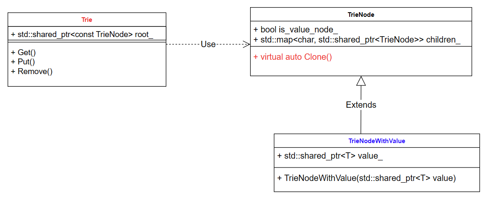
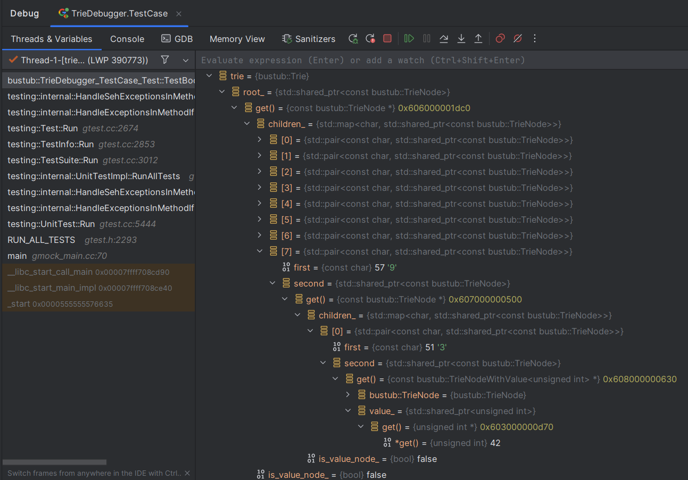
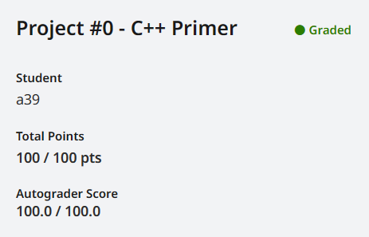

# CMU 15445 Spring

## Project 0

### Modern C++

此前对于 C++ 的了解仅限于 OOP 和一点点 STL，对 Modern C++ 的特性其实仅限于听过，打开 Project 发现压根看不懂大量使用 Modern C++ 的代码，所以首先简单熟悉下 Project 0 相关且我不熟悉的语法和概念

- 参考：[changkun/modern-cpp-tutorial](https://github.com/changkun/modern-cpp-tutorial)

#### 智能指针

传统 C++ 中，我们申请的一块内存在离开其生命周期后需要我们记得手动释放，否则很容易造成内存泄漏，这就带来了无穷无尽的 bug 和极大的心智负担。而像析构函数或引用计数（不包括 GC）这些设计带来的自动资源释放就显得方便不少，这种技术就叫做 RAII（资源获取即初始化）。从 C++11 开始引入的智能指针就是一种 RAII

`std::shared_ptr`

`std::shared_ptr`能够记录多少个`shared_ptr`共同指向一个对象，当引用计数变为零的时候就会将对象自动删除，从而无需显式的调用`delete`。`std::make_shared`会分配创建传入参数中的对象， 并返回这个对象类型的`std::shared_ptr`指针。`std::shared_ptr`可以通过`get()`方法来获取原始指针（不会增加引用计数），通过`reset()`来减少一个引用计数， 并通过`use_count()`来查看一个对象的引用计数

```c++
#include <iostream>
#include <memory>
void foo(std::shared_ptr<int> i) {
    (*i)++;
}
int main() {
    auto pointer = std::make_shared<int>(10);
    foo(pointer);
    std::cout << *pointer << std::endl; // 11
    
    auto pointer2 = pointer; // 引用计数+1
	auto pointer3 = pointer; // 引用计数+1
    
    int *p = pointer.get();  // 这样不会增加引用计数
	std::cout << "pointer.use_count() = " << pointer.use_count() << std::endl;   // 3
	std::cout << "pointer2.use_count() = " << pointer2.use_count() << std::endl; // 3
	std::cout << "pointer3.use_count() = " << pointer3.use_count() << std::endl; // 3

	pointer2.reset();
	std::cout << "reset pointer2:" << std::endl;
	std::cout << "pointer.use_count() = " << pointer.use_count() << std::endl;   // 2
	std::cout << "pointer2.use_count() = "
          << pointer2.use_count() << std::endl;           // pointer2 已 reset; 0
	std::cout << "pointer3.use_count() = " << pointer3.use_count() << std::endl; // 2
    
	pointer3.reset();
	std::cout << "reset pointer3:" << std::endl;
	std::cout << "pointer.use_count() = " << pointer.use_count() << std::endl;   // 1
	std::cout << "pointer2.use_count() = " << pointer2.use_count() << std::endl; // 0
	std::cout << "pointer3.use_count() = "
          << pointer3.use_count() << std::endl;           // pointer3 已 reset; 0
    return 0;
}
```

`std::unique_ptr`

`std::unique_ptr`是一种独占的智能指针，它禁止其他智能指针与其共享同一个对象，换句话说就是不可复制。比较搞的是 C++11 没有提供 `std::make_unique`（因为被组委会忘记了），但是后续的标准重新添加了`std::make_unique`。虽然内存是被独占的，但是我们可以利用`std::move`将其转移给其他的`unique_ptr`

```c++
std::unique_ptr<int> pointer = std::make_unique<int>(10); // make_unique 从 C++14 引入
std::unique_ptr<int> pointer2 = pointer; // 非法
```

```c++
#include <iostream>
#include <memory>

struct Foo {
    Foo() { std::cout << "Foo::Foo" << std::endl; }
    ~Foo() { std::cout << "Foo::~Foo" << std::endl; }
    void foo() { std::cout << "Foo::foo" << std::endl; }
};

void f(const Foo &) {
    std::cout << "f(const Foo&)" << std::endl;
}

int main() {
    std::unique_ptr<Foo> p1(std::make_unique<Foo>());
    // p1 不空, 输出
    if (p1) p1->foo();
    {
        std::unique_ptr<Foo> p2(std::move(p1));
        // p2 不空, 输出
        f(*p2);
        // p2 不空, 输出
        if(p2) p2->foo();
        // p1 为空, 无输出
        if(p1) p1->foo();
        p1 = std::move(p2);
        // p2 为空, 无输出
        if(p2) p2->foo();
        std::cout << "p2 被销毁" << std::endl;
    }
    // p1 不空, 输出
    if (p1) p1->foo();
    // Foo 的实例会在离开作用域时被销毁
}
```

`std::weak_ptr`

虽然`std::shared_ptr`有引用计数，但如果出现相互引用或者循环引用的情况（比如 A 和 B 互相引用对方，那么它们就有自身和对面共两个引用计数），到最后还是会出现离开生命周期后还是无法被释放的问题。`std::shared_ptr`就用于解决这种问题，它提供一种弱引用机制（相对地，`std::shared_ptr`就是强引用），而弱引用的特别之处在于不会增加引用计数。`std::weak_ptr`没有`*`和`->`运算符，所以不能够对资源进行操作，但它能用于判断引用的对象是否还存在。`expired()`方法能在资源未被释放时返回`false`，否则返回`true`。除此之外，`lock()`方法可以在原始对象未被释放时返回一个指向原始对象的`std::shared_ptr`指针，若被释放则返回`nullptr`，用此方法就可以操作引用对象了

#### std::future

`promise`/`future` 是其他语言中常见的非阻塞并发模型，`future`表示一个可能还没有实际完成的异步任务的结果，针对这个结果可以添加回调函数以便在任务执行成功或失败后做出对应的操作（回调就是自己写了却不调用，给别人调用的函数），而`promise`交由任务执行者，任务执行者通过`promise`可以标记任务完成或者失败。所以`promise`/`future`模型本质上还是任务线程与主线程的消息传递

在 C++11 之前，如果主线程需要使用子线程的执行结果，通常是让子线程完毕后发送事件并将结果保存到一个全局变量中，然后主线程运行到需要子线程执行结果的时候调用一个线程等待函数来获得执行结果。而`std::future`大大简化了这一过程，由于本人才疏学浅不太会形容，所以具体看下面的示例代码

```c++
#include <iostream>
#include <future>
#include <thread>

int main() {
    // std::packaged_task 的模板参数为要封装函数的类型
    std::packaged_task<int()> task([](){return 7;});
    // 获得 task 的 future
    std::future<int> result = task.get_future(); // 在一个线程中执行 task
    std::thread(std::move(task)).detach();
    std::cout << "waiting...";
    result.wait(); // 在此设置屏障，阻塞到 future 的完成
    // 输出执行结果
    std::cout << "done!" << std:: endl << "future result is "
              << result.get() << std::endl;
    return 0;
}
```

- 关于 STL 的多线程库其实还有很多值得学习的内容，这里篇幅所限不进行展开

#### std::move

首先讲讲以前上课就没搞懂的左值、右值、纯右值和将亡值

- 左值：顾名思义就是赋值符号左边的值，准确来说左值是表达式（不一定是赋值表达式）结束后依然存在的持久对象
- 右值：就是右边的值，指表达式结束后就不再存在的临时对象
- 纯右值：要么是纯粹的字面，要么是求值结果相当于字面量或匿名临时对象
  - 非引用返回的临时变量、运算表达式产生的临时变量、 原始字面量、Lambda 表达式都属于纯右值
  - 在传统 C++ 中，右值和纯右值其实是没有区别的
- 将亡值：就是即将被销毁、却能够被移动的值
  - 举个例子，如果赋值语句的右值是个函数的返回值，类型为`vector`，但这个返回值非常巨大，那么在赋值的过程中就需要首先拷贝给左值的`vector`，然后释放掉右值，可想而知非常慢。但如果我们可以将这个临时的右值移动给左值，那就能大大简化这一不必要的过程。这种设计其实就是移动语义
  - 将亡值其实是为了引入右值引用和移动语义而提出的概念

要想拿到一个将亡值，就需要用到右值引用`T &&`，其中 `T` 是类型。 声明右值引用可以让这个临时值的生命周期得以延长：只要变量还活着，将亡值就可以继续存活

C++11 提供了`std::move`这个方法将左值参数无条件的转换为右值，配合移动构造函数就可以实现移动操作。被移动后将亡值里对内存的引用需要被无效化，防止被其析构函数销毁

```c++
#include <iostream>
class A {
public:
    int *pointer;
    A():pointer(new int(1)) {
        std::cout << "构造" << pointer << std::endl;
    }
    A(A& a):pointer(new int(*a.pointer)) {
        std::cout << "拷贝" << pointer << std::endl;
    } // 无意义的对象拷贝
    A(A&& a):pointer(a.pointer) {
        a.pointer = nullptr; // 防止内存区域被销毁
        std::cout << "移动" << pointer << std::endl;
    }
    ~A(){
        std::cout << "析构" << pointer << std::endl;
        delete pointer;
    }
};
// 防止编译器优化
A return_rvalue(bool test) {
    A a,b;
    if(test) return a; // 等价于 static_cast<A&&>(a);
    else return b;     // 等价于 static_cast<A&&>(b);
}
int main() {
    A obj = return_rvalue(false);
    std::cout << "obj:" << std::endl;
    std::cout << obj.pointer << std::endl;
    std::cout << *obj.pointer << std::endl;
    return 0;
}
```

```c++
#include <iostream> // std::cout
#include <utility> // std::move
#include <vector> // std::vector
#include <string> // std::string

int main() {

    std::string str = "Hello world.";
    std::vector<std::string> v;

    // 将使用 push_back(const T&), 即产生拷贝行为
    v.push_back(str);
    // 将输出 "str: Hello world."
    std::cout << "str: " << str << std::endl;

    // 将使用 push_back(const T&&), 不会出现拷贝行为
    // 而整个字符串会被移动到 vector 中，所以有时候 std::move 会用来减少拷贝出现的开销
    // 这步操作后, str 中的值会变为空
    v.push_back(std::move(str));
    // 将输出 "str: "
    std::cout << "str: " << str << std::endl;

    return 0;
}
```

- 关于右值引用还有如完美转发等许多值得推敲的地方，篇幅限制这里不进行展开

#### explicit 关键字

C++ 的构造函数会有奇怪的隐式转换，比如构造函数本应传入对应类的对象，但如果我们直接传入某个合适类型的参数或在没有重载`=`的情况下直接赋值，C++ 一样会调用构造函数并赋值给类成员（C++ 默认函数最左边的参数优先级最高，所以会优先赋值给参数列表中最左边的变量）

`explicit`关键字其实就是提醒编译器不允许这种隐式转换，传入参数必须严格符合构造函数或转换函数的定义，即必须被显式调用

#### delete/default 关键字

传统 C++ 中如果我们没有为类定义构造函数、 复制构造、赋值算符以及析构函数，编译器就会自动帮我们生成一个。但是这样生成默认函数有时不符合我们的需求（比如禁止拷贝构造，那就只能将类成员声明为`private`）；并且默认函数与我们自己的函数不会共存，但有时方便起见我们会想让这两种函数共存，于是就诞生了`delete`/`default`关键字。`delete`显式声明不使用编译器的默认函数，而`default`显式声明使用默认函数

#### noexcept 关键字

`noexcept`关键字可以放在函数声明和函数定义的括号后面，表示该函数不会抛出任何异常。`noexcept`关键字是一个非常有用的语法糖，它可以帮助我们指示函数是否可能抛出异常，从而进行一些优化

#### std::optional

在实际编程中我们常常会遇到需要处理结果为空的情况，通常的做法有：

- 使用 NULL 或 -1 之类的 Magic Number，但如果这些值也在有效值域内就比较麻烦了
- 使用一个布尔值或用`errno`，但这样的设计会让接口显得冗余，而且使用者常常懒得检查这些值
- 抛出异常，然后用`try-catch`进行异常处理，但这样会造成大量冗余代码，还会让代码的可读性变差

`std::optional<T>`就可以用于解决这些问题。`std::optional<T>`可以看作是 T 类型变脸与一个布尔值的打包,其中的布尔值用来表示 T 是否为空。`std::optional<T>`几乎拥有所有能想到的优良性质：

- 任何一个`T`类型或可以隐式转换成`T`类型的变量都可以用来构造它的对象，同样，我们也可以用`std::nullopt`或默认构造函数来构造它，此时其意义就是空
- 使用`std::make_optional`也可以构造一个`T`类型的`std::optional`
- 使用`has_value()`函数来询问`std::optional`此时是否有值
- 如果有值，就可以使用`value()`函数来获取他的值；如果`std::optional`没有值时调用`value()`就会抛出一个`std::bad_optional_access`异常
- 需要注意的是，`std::optional<T>`在内部存储`T`变量，并没有用到动态分配内存
- `std::optional`可以显式地转化为`bool`型变量来显示他此时是否为空（也就是说可以直接作为判断语句的表达式）
- 重载`*`和`->`操作符，但是在使用前一定要使用`has_value()`函数检验变量是否含有值
- 使用`reset()`方法可以销毁存储在`std::optional`中的值，并将其值为空

### Task 1 C++ Primer

Task 1 要我们实现一个支持 COW 的 Trie（字典树）的三个方法：`Get`、`Put`、`Remove`，由于是 COW，所以`Put`和`Remove`返回的都是一个新的 Trie，即需要创建一个新的 root，然后从原来的 root 开始一直拷贝到变动的 node 为止

源码中给了我们三个类的定义：`Trie`、`TrieNode`、`TrieNodeWithValue`，UML 图大致如下



- `Trie`包含了整个 Trie 的 root，并定义了我们要实现的三个方法
- `TrieNode`则是 Trie 的节点，由于 Trie 的 key 是可以没有 value 的，所以定义了一个布尔变量`is_value_node`用来标识这个节点是否含有 value，然后就是一个从`char`映射到`shared_ptr`的`map`用于存储不同的子分支的映射。另外还定义了一个虚函数`Clone`用于复制节点
- `TrieNodeWithValue`继承于`TrieNode`，它就是有 value 的节点

#### Get

`Get`方法接收一个`string_view`类型的 key，返回一个指向 value 的裸指针，其中 value 是泛型。`Get`方法其实只需要按顺序遍历 key 中的字符，然后找到 Trie 中每层节点对应的映射就可以最终得到 value，需要考虑的边界条件有

- key 不存在，直接返回 nullptr
- 终止节点不是 value 节点，同上
- 终止节点 value 类型匹配问题，由于 value 的类型多种多样不好判断，注释提醒我们可以用`dynamic_cast`转换到`Get`指定的泛型，然后根据转换是否成功来判定

#### Put

`Put`方法接收一对 key-value，将其放入 Trie 中，最后返回一个 Trie。`Put`的主要逻辑是一边遍历 key 一边复制 Trie，遍历到最后一个字符时就判断 key 是否已经存在，存在则创建一个 value 不同（即覆盖 value）但子节点相同的节点，不存在则直接创建新节点。由于`Put`还负责创建和修改 Trie，所以需要考虑的边界条件比较多，有

- 空 Trie，也就是初始情况，直接创建一个节点
- 空 key 但有 value（也就是 root 有 value），这是在测试代码中的情况，处理方法是将 root 置为一个只有 value 的`TrieNodeWithValue`节点
- 插入的位置没有 value，那就将节点转换为`TrieNodeWithValue`

#### Remove

`Remove`接收一个 key，将它的 value 从 Trie 中删除掉，最后返回一个 Trie。`Remove`规定我们如果一个节点既没有 value 又没有子节点，那就直接删掉这个节点。实现方法其实非常简单直接，直接对 Trie 的 key 子树进行深搜，如果节点既没有 value 又没有子节点就返回 nullptr，如果对应 key 的节点有 value 就将它转换为`TrieNode`

### Task 2 Concurrent Key-Value Store

任务的目标是基于上面的 Trie 实现一个单写者多读者的并发 KV 存储，具体只需要完成`TrieStore`类的`Get`、`Put`、`Remove`方法即可。`TrieStore`的成员是一个`Trie`的 root，以及一个 root 的互斥锁和一个写者互斥锁。由于前面实现的 Trie 是支持 COW 的，由于存储了历史版本信息，COW 天然对并发读写有很好的支持，所以我们只需要控制好写者锁即可（其实连 root 锁都不需要上，不过既然源码给出来了还是写上比较好）

`Get`方法要求我们返回一个`ValueGuard`类，包含 root 和我们读到的 value。实现方法非常简单，上 root 锁获取 root 后解锁，调用`Trie.Get`获取 value，将它们存放在`ValueGuard`对象里并返回即可

`Put`和`Remove`类似，整段代码都上写者锁，然后互斥获取根节点后调用`Trie`的对应函数，最后替换`This->root`为新版本 Trie 的 root 即可

### Task 3 Debugging

不太会配 VSCode 的调试，所以换用了 CLion，打开`test/primer/trie_debug_test.cpp`，在注释标出的位置下断点，然后点`TEST`旁边的三角选 debugging，编译好后就能在窗口看到 Trie 的结构了，然后对着下面的三个问题找答案就行。由于测试依赖于随机数，WSL 环境下的结果（8、1、42）和提交环境的结果（7、2、30）不同，所以熟悉下调试直接填提交环境的答案就行



### Task 4 SQL String Functions

前面的三个 Task 都是用来给我们熟悉 Modern C++ 和项目代码风格的 Intro，Task 4 才真正带我们接触 Bustub 的代码（其实如果只是完成 Task 的话不熟悉也没啥难度），但是由于我做到 Project 0 的时候课才听了一点，对于 db 内核的结构还不甚了解，所以这里不分析了，以后跟着课程自会慢慢理解

Task 4 要求我们实现 SQL 里的`lower`函数和`upper`函数，具体要在`plan_func_call.cpp`的`Planner::GetFuncCallFromFactory`实现解析将要执行的是`lower`还是`upper`，然后到`StrnigExpression.cpp`的`Compute`函数里实现具体逻辑。除了比较烦人的 Clang-tide 代码风格要求 else 之前不能有 return 和 throw，以及我对 STL 给出的各种非常 Magical 的方法不太熟悉，其余的逻辑其实都很简单，这里就不废话了

### Submit

格式化、打包代码

```shell
cd build
make format
make check-lint
make check-clang-tidy-p0
make submit-p0
```

生成的压缩包位于项目根目录，提交到 gradescope 即可



## Project 1

### Modern C++

#### 尾置返回类型

#### override 关键字

#### [[maybe_unused]]

#### std::mutex

#### std::lock_guard

#### std::unordered_map

#### 移动构造、移动赋值

### Task 1 LRU-K Replacement Policy

#### LRU-K 淘汰策略

LRU-K 实际上就是维护两个队列，历史队列负责记录近期被访问次数小于 k 的页面，采用 FIFO 策略进行淘汰；而缓存队列记录最近被访问次数大于 k 的页面，采用 LRU 策略进行淘汰；历史队列中的页面被访问次数到达 k 次后就会被换进缓存队列中

不难发现，相比于 LRU，LRU-K 下缓存数据更不容易被替换，并且偶发性的数据不易被缓存，在保证了缓存数据纯净的同时还提高了热点数据命中率

#### 相关数据结构

Project 帮我们预设了一些可能会被使用的类成员，只需要去掉`[[maybe_unused]]`关键字即可使用，同时也不限制我们新增其他成员。不过我没太 get 到`LRUKNode`中的预设成员的含义，所以就只能尽量使用这些预设成员变量

原本`LRUKReplacer`类带有的`node_store_`和`current_timestamp_`这里并没有用到。我使用了`LRUKReplacer`中的所有预设的成员变量，并使用了`LRUKNode`中用于记录页面是否被记为淘汰的布尔成员变量`is_evictable_`、页面使用计数用的`k_`、除此之外，我还增添了历史记录和缓存各一个双向链表（记录页面号，用于实现根据访问顺序排队和淘汰）和哈希表（value 是一个迭代器，记录当前页面在链表中的位置）

注意`LRUKNode`的成员都是私有的，而在`LRUKReplacer`的方法里需要获取和操作这些私有成员，所以别忘了加上 getter 和 setter

对于所有方法的并发安全问题，我这里比较粗粒度地在每个方法前使用`std::lockguard`进行并发控制，这样实现的代码比较简洁

#### Evict

`Evict`方法负责找到 LRU-K 策略下要淘汰的帧并淘汰该帧，只有标记为`is_evictable_`的帧才会在淘汰时被候选，若找到则设置`frame_id`指针并返回`true`，否则返回`false`

确认两个队列非空后，首先从队尾开始遍历历史队列尝试找出一个`is_evictable_`为`true`的页面，若找到则将其和相关记录清除，若没找到则在缓存队列中重复这一过程，若都找不到就直接返回`false`即可

由于在缓存队列中，后续方法的策略是每次访问页面都会将页面重新插入到队列的首部，这里从队尾开始遍历可以直接找出 最近最少使用的可淘汰页面，这样就不需要遍历比较一遍时间戳了

#### RecordAccess

`RecordAccess`方法负责记录给定的页面在当前时间戳的访问事件

检查`frame_id`的有效性后更新页面的访问计数，如果此前并未访问过此页面则在历史队列里新增条目；如果访问次数达到 k 则将页面从历史队列擦除，并插入到缓存队列的首部；如果访问次数大于 k 则意味着页面已经在缓存队列里了，那么就将页面重新插入到缓存队列的首部；剩下如果访问次数大于 0 小于 k，说明其在历史队列中，那么只需要增加访问记录即可，不需要调整其在历史队列的顺序（因为新增时是插入队首，最后淘汰时也从队尾开始淘汰，符合 FIFO）

前面`Evict`方法提到过，这里将被访问的页面重新插入到队列首部，目的是让处于队尾的页面

#### SetEvictable

`SetEvictable`方法负责强制设置指定页面的`is_evictable_`状态（注意，这里既可以设置为`true`又可以设置为`false`）

首先需要判断传入的`frame_id`是否合法，还要判断此页面此前是否被访问过（即 k 是否为非 0），通过检查后就根据页面此前的状态和对应的操作重新调整整个`LRUKReplacer`的`curr_size`，最后设置对应页面的`is_evictable_`状态即可

#### Remove

`Remove`方法负责淘汰掉一个可淘汰的页面，这里首先判断有效性和是否可淘汰，然后根据访问次数判断页面在哪个队列中，最后将其从队列中擦除并清除掉相关状态即可

#### 测试

其实也没什么东西，唯一要注意的是如果想要进行测试，就需要找到测试对应源码，删掉`TEST`函数参数名里的`DISABLED_`前缀，否则该测试会直接被跳过

### Task 2 Buffer Pool Manager


### Task 3 Read/Write Page Guards


### Submit

有一个比较古怪的点是代码风格检查工具 CppLint 限制了 C++11 下`<mutex>`头文件的使用，如果不修改的话在`check-lint`的时候会报错`<mutex> is an unapproved C++11 header.`导致过不了编译直接零分。以下是 CppLint 脚本相关部分的源码

```python
# Flag unapproved C++11 headers.
if include and include.group(1) in ('cfenv',
                                  'condition_variable',
                                  'fenv.h',
                                  'future',
                                  'mutex',
                                  'thread',
                                  'chrono',
                                  'ratio',
                                  'regex',
                                  'system_error',
                                 ):
error(filename, linenum, 'build/c++11', 5,
      ('<%s> is an unapproved C++11 header.') % include.group(1))
```

解决办法是在`.cpp`文件里删掉头文件`<mutex>`的包含（`.h`文件里的不用删），至于具体原因我也没有查到，有点怪

### 优化

Project 1 开放了 Leaderboard，搞性能优化刷排名也是 15445 Lab 最精华的部分之一，但一是这是我第一次接触 DBMS，还不太熟悉 DBMS 的整体架构还需要点时间缕缕，二是目前我用的是 WSL 不方便装 perf 不好进行性能分析，所以目前我先不进行优化了

但是当前还是能想到有几个可能可以优化的点：

- `BufferPoolManager`、`LRUKReplacer`都是无脑大锁一把嗦，多线程下必然会拖慢运行速度，可以改成更加细粒度的锁，比如每个`page_id`一个锁
  - 我还看到有用二阶段锁来优化的，不过暂时超出了我的知识范围
- 测试中有区分 workflow 的`AccessType`（更离散的`Get`和更全局的`Scan`），其实可以针对不同的`AccessType`对`LRUKReplacer`的替换策略进行优化
- 方便起见我还在`LRUKReplacer`中使用了很多哈希表，但听说 C++ 的哈希表性能其实一般般，针对这个还可以进行部分优化

由于能力所限以及没经过实操，这里我也只能猜个十之一二，下面贴点大佬的链接

- [CMU 15-445 2023 P1 优化攻略 - 散落的叶子 (aneureka.com)](https://www.aneureka.com/posts/cmu-15445-p1-opt)
- [CMU 15445 Project 1 - xxxl's Blog (4ever-xxxl.github.io)](https://4ever-xxxl.github.io/cmu-15445-project-1/#leaderboard-task)
- [记录一次 perf 性能调优 CMU 15-445 - 知乎 (zhihu.com)](https://zhuanlan.zhihu.com/p/572190574)
- [CMU15445 (Spring 2023) #Project1 优化_cmu15445 project1-CSDN博客](https://blog.csdn.net/weixin_70354558/article/details/130663075)
